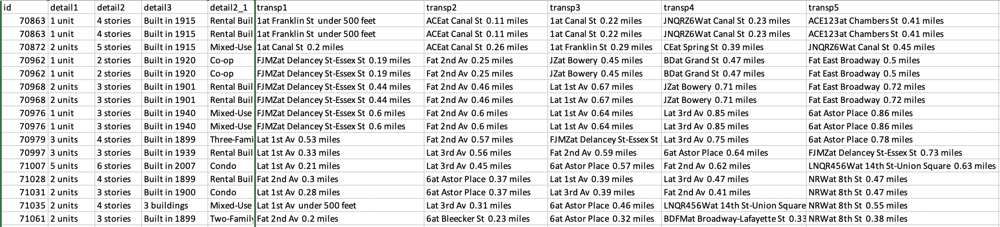
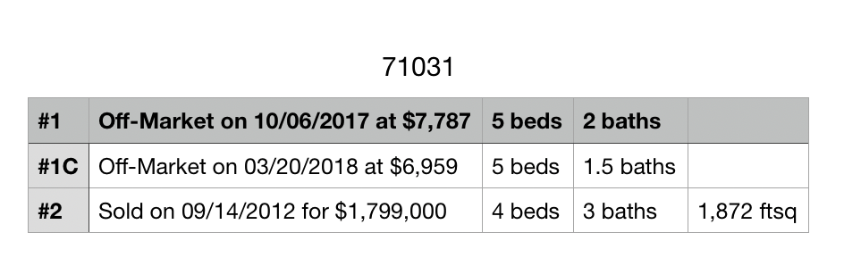
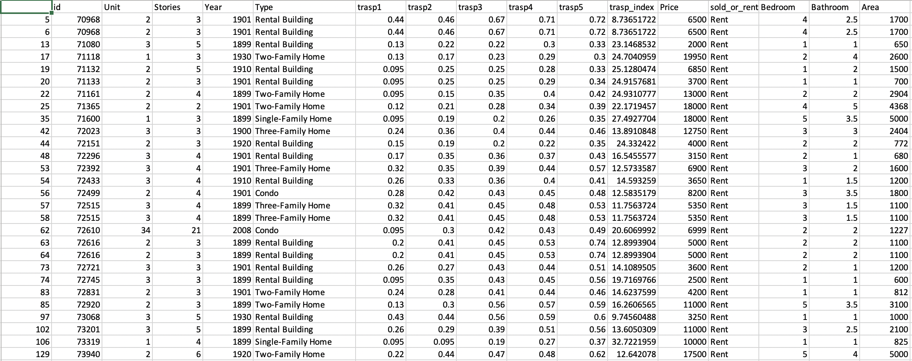
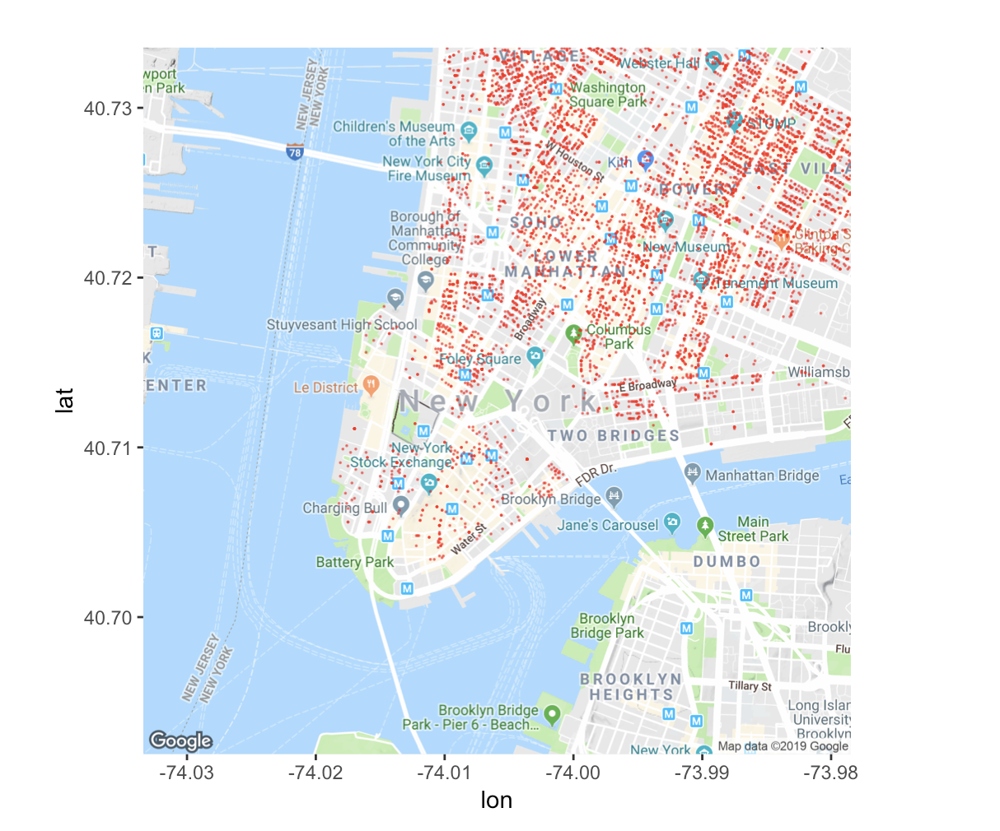
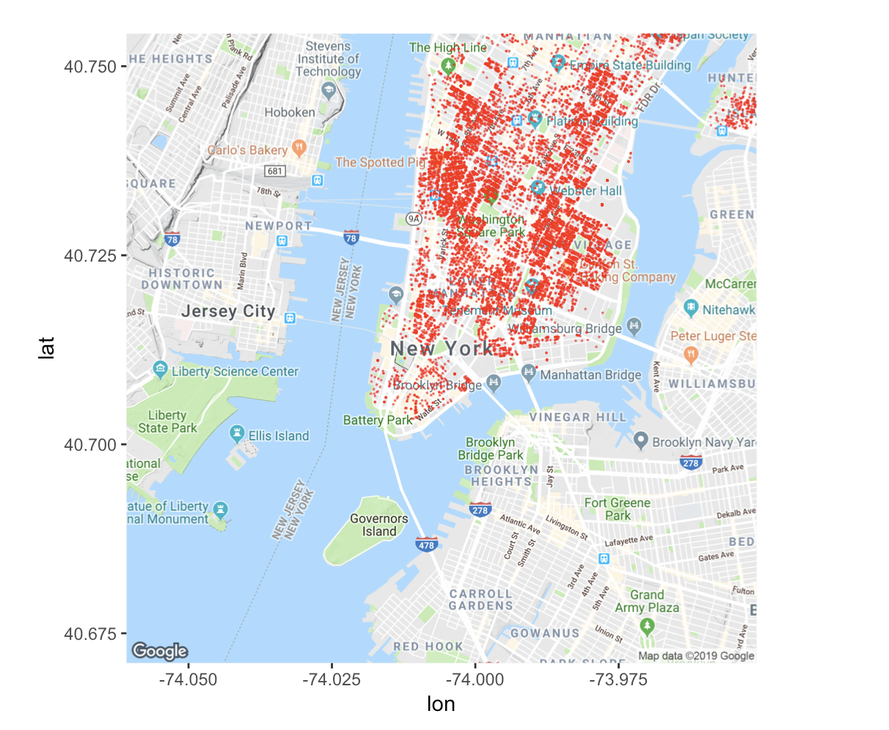

### Introduction

The rents is an important topic among New Yorkers, since the rents is very high compared with rent in other places, and boosted by strong economic growth, rents have increased by 30 percent across New York City since the end of the 2008 financial crisis. So we are curious about what are the influence factors of rent price and what's the distribution of area and apartment structure. Also, we want to get the apartments distribution in New York, then we can get the idea what's other area we can relocate in the future. Also, we want to know whether there is a relationship between the built year and building type, that is, maybe during particular period, people would like to build rental building, since there maybe less people who want to buy apartments. So we choose this topic and draw related graphics.

### Source of Data

We get the data by using web scraper from Streeteasy website. Because of the limitation of time, we only collect over 30,000 apartments' data, if we have more time we can get more information about apartments in NYC. Also, in our data, we get variables like built year, building type(character), subway distance, price of rent(float), bedroom number, bathroom number, area, which are very important to our project. However, if we have more choice, we would like to get the amenity of the building, which is also essential to rent price. 

### Description of data import / cleaning / transformation

The original data 1 looks like following picture.The ID column means the ID of every house which is unique. Detail1 and detail2 stands for the number of units and stories in the house. Besides, detail3 shows the year that the house was built and detail2_1 means the type of the house. Transp1 to transp5 include distances to main streets.In following analysis, we only used distances in transpotation columns.



Original data 2 has several files. Every csv file includes ID, price and property of one house. The name of the file is exactly the ID of the house. For every file, we picked the most recent price of a house. For example, $7787 in following picture. We used python to extract values from this two dataset and combined them into processed data.




### Analysis of missing values

For missing values, we dropped them.

### Analysis of data

```{r setup, include=FALSE}
knitr::opts_chunk$set(echo = TRUE, warning = FALSE,
		                      message = FALSE, cache = FALSE)
```

```{r}
install.packages('plotly', repos='http://cran.rstudio.com/115', dependencies=TRUE)
```

```{r}
library(plotly)
library(dplyr)
library(shiny)
library(purrr)
library(vcd)
library(ggmap)
```

```{r}
data=read.csv("../data/data_final.csv")
```

First, we wonder if there is a trend to build different kinds of building in different age, so we drew a mosaic plot with age and type. Since there are some type only with few houses, we didn't include them in this step. We considered two main type: Condo and Rental Building. From the picture, we got that majority of houses were built in 1891 to 1920 and, with time going by, the proportion of Rental Building decreased.

```{r}
year_int=function(year)
{
  if(year<1921)
    return("1891-1920") else if(year<1951)
        return("1921-1950") else if(year<1981)
            return("1951-1980") else
                return("1980-now")
}
data=cbind(data,year_interval=rep(0,dim(data)[1]))
for(i in 1:dim(data)[1]){
  data$year_interval[i]=year_int(data$Year[i])
}

b=data[data$Type=="Rental Building"|data$Type=="Condo",]
b$Type=array(b$Type)
mosaic(~year_interval+Type,
       data = b,
       labeling = labeling_border(abbreviate_labs = c(10, 10),
                                  rot_labels = c(0, 0, 60, 0)),
       gp = gpar(fill = c("lightblue", "blue"),col = "white"))


```

Then, from our common scence, price is highly related with the area of the apartment and the transportation distance. Shorter the distance, higher the rent price, also, larger the area, higher the rent price.So we draw 3d plot to see the relationship. In the plot, x axis stands for transportation distance, y axis stands for area and z means price. When rotate the plot, you can see a positive relationship between Price and Area and a negative relationship between Price and transportation distance.

```{r}
p=plot_ly(data, x=data$trasp1,y=data$Area,z=data$Price,mode = "markers", marker = list(size = 4),alpha=0.7)
p <- layout(p,title="Price with Area&transpotation")
p
```
Also, from our common scence, if the building is newer, the price is higher. Also, when the apartment's story is higher, the view is better, then the price is higher. So we draw 3d plot to see the relationship. In the plot, x axis stands for Story, y axis stands for built year and z means price. When rotate the plot, you can see a positive relationship between Price and story and a negative relationship between Price and built year. However, there are many points show that the effects of built year and story factors on price is not so strong.
```{r}
p=plot_ly(data, x=data$Stories,y=data$Year,z=data$Price,mode = "markers", marker = list(size = 4),alpha=0.7)
p <- layout(p,title="Price with built year&transpotation")
p
```

Besides, we want to know more about price data. For example, if I have a house and I know the number of bedrooms and bathrooms, I would be curious about the price distribution of similar housings. We draw R shiny to get a conclusion. From the R shiny we can choose different number of bedrooms and bathrooms to get the distribution of rent price of the apartment. What's more, we can also see that with the increasing of bedroom number or bathroom number, the medium rent price also increase.
   https://xishi-chen.shinyapps.io/final_project/


Following, we try to get some genral idea about our data. We create the interactive histogram of area in our data to see the distribution of area. The distribution is closed to normalized distribution with mean at 1000.

```{r}
library(plotly)
q <- plot_ly(y = data$Area , type = "histogram", histnorm = "probability")
q
```

Now We create the interactive histogram of area in our data to see the distribution of bedroom number.

```{r}
library(plotly)
p <- plot_ly(x = data$Bedroom,
             type = "histogram",
             histnorm = "probability")
p
```

Now We want to see the distribution of bathroom number.

```{r}
housing_price=data
p <- plot_ly(x = housing_price$Bathroom,
             type = "histogram",
             histnorm = "probability")
p
```

Then, we try to compare the distribution of price under different type of housings. The blue one stands for Rental Building and the orange one means Condo. The distribution of these two types concentrate on price at 3000.

```{r}
rand=data[data$Type=="Rental Building",]
condo=data[data$Type=="Condo",]
p=plot_ly(alpha=0.6)%>%
  add_histogram(x=rand$Price)%>%
  add_histogram(x=condo$Price)%>%
  layout(barmode="overlay")
p
```

Then, we draw a summary plot to show the relationship between variables. Different colors in following picture stand for different type of housing.

```{r}
pl_colorscale=list(c(0.0, '#19d3f3'),
               c(0.333, '#19d3f3'),
               c(0.333, '#e763fa'),
               c(0.666, '#e763fa'),
               c(0.666, '#636efa'),
               c(1, '#636efa'))
axis = list(showline=FALSE,
            zeroline=FALSE,
            gridcolor='#ffff',
            ticklen=4)
p <- data %>%
  plot_ly() %>%
  add_trace(
    type = 'splom',
    dimensions = list(
      list(label='transpotation', values=~trasp1),
      list(label='Area', values=~Area),
      list(label='Bedroom', values=~Bedroom),
      list(label='Price', values=~Price)
    ),
    text=~class,
    marker = list(
      color = as.integer(data$Type),
      colorscale = pl_colorscale,
      size = 7,
      line = list(
        width = 1,
        color = 'rgb(230,230,230)'
      )
    )
  ) %>%
  layout(
    title= 'Housing Price data',
    hovermode='closest',
    dragmode= 'select',
    plot_bgcolor='rgba(240,240,240, 0.95)',
    xaxis=list(domain=NULL, showline=F, zeroline=F, gridcolor='#ffff', ticklen=4),
    yaxis=list(domain=NULL, showline=F, zeroline=F, gridcolor='#ffff', ticklen=4),
    xaxis2=axis,
    xaxis3=axis,
    xaxis4=axis,
    yaxis2=axis,
    yaxis3=axis,
    yaxis4=axis
  )
p
```


Then we want to oversee the distribution of apartments in NYC from google map, so we import location data and get that by using API. We can get that most of the apartments distributed in Manhattan, then Queens and Brooklyn.

```{r}
location_new = read.csv("../data/location_new.csv", header = TRUE)
head(location_new[,c("id","x","y")],3)
```

The minimun and maximun of longitude is as following:

```{r}
min(location_new$y)
max(location_new$y)
```

The minimun and maximun of latitude is as following:

```{r}
min(location_new$x)
max(location_new$x)

```



To get better result, we let the map to include more area. (for reproducibility, we use screenshots here, the code for drawing these two plots is in the commentmap1)




```{r}
# nyc_base <- ggmap::get_map("New York City", zoom = 14)
# ggmap(nyc_base) + geom_point(data=location_new, aes(x=y, y=x), color="red", size=0.001, alpha=0.5)
# nyc_base <- ggmap::get_map("New York City", zoom = 13)
# ggmap(nyc_base) + geom_point(data=location_new, aes(x=y, y=x), color="red", size=0.001, alpha=0.5)
```


### Conclusion

Rent price is highly related with area, bedroom number, bathroom  number and subway distance. With the increasing of area number, the rent price also rises. With the increasing of bedroom number or bathroom number, the rent price also increases. And most of the apartments distributed in Manhattan, then Queens and Brooklyn.

In this report, we try some new type of plots, such as map plot and 3d scatter plot. However, due to the limitation of data, we only analysis several variables.


